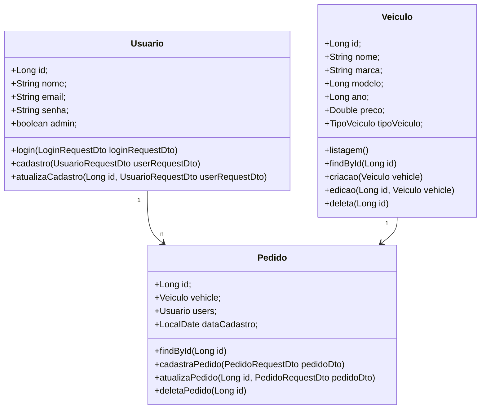

# Concessionária


## Sobre o projeto

- Esta API simula um aplicativo para a venda de Veículos. Ela foi desenvolvida utilizando o Spring Framework
e oferece funcionalidades para o gerenciamento de Usuários, Veículos e Pedidos.

## Instruções de Uso

- Para manuseio da API é necessário que criar um Usuário e fazer login com o mesmo.
- Somente Usuários do tipo admin podem cadastrar, atualizar ou deletar Veículos.
- Todos os Usuários podem passear pela Vitrine ou realizar um Pedido.
- Para realizar um Pedido, basta informar o Id do Usuário e do Veículo.
- Para atualizar um Pedido, o Id do Usuário não pode ser alterado, somente o Id do Veículo.

## Tecnologias Utilizadas

- Spring WEB
- Spring Data JPA
- Spring Security
- Spring Documentation
- Lombok
- H2 Database
- Autenticação JWT

## Download

```bash
git clone https://github.com/DiegoCasemiroFS/concessionaria.git
```

## Documentação 

```bash
http://localhost:8080/v3/api-docs
```

```bash
http://localhost:8080/swagger-ui/index.html
```

## Diagrama das Classes


