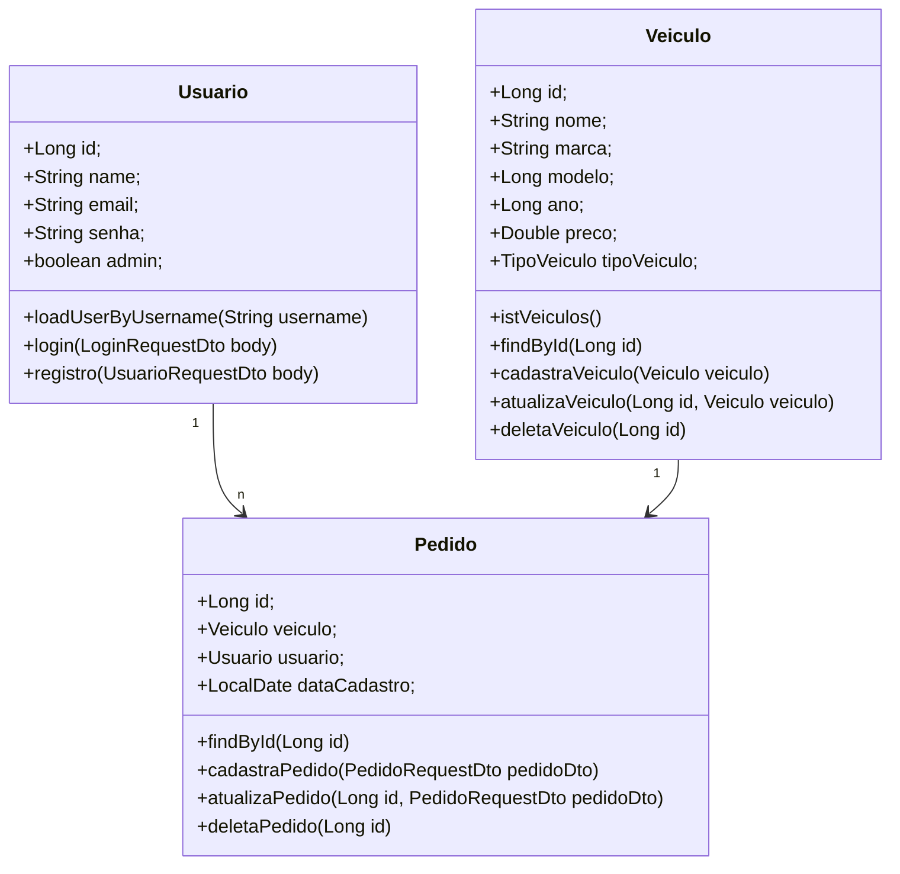

# Concessionaria


## Sobre o projeto

Esta API simula um aplicativo para a venda de veículos. Ela foi desenvolvida utilizando o Spring Framework
e oferece funcionalidades para o gerenciamento de usuários, veículos e pedidos.

## Técnologias Utilizadas

- Spring WEB
- Spring Data JPA
- Spring Security
- Lombok
- H2 Database
- Autenticação JWT

## Instruções para Download

```bash
git clone git clone https://github.com/DiegoCasemiroFS/concessionaria.git
```

## Diagrama das Classes



## Endpoints

### Usuario

POST - Para realizar o cadastro de novos Usuários
```bash
http://localhost:8080/usuario/registro
```
```bash
{
    "nome": "Diego",
    "email": "diego@test.com",
    "senha": "123456",
    "admin": true
}
```

POST - Para realizar login
```bash
http://localhost:8080/usuario/login
```
```bash
{
    "email": "diego@test.com",
    "senha": "123456"
}
```

### Veiculo 

GET - Para obter a listagem dos Veículos
```bash
http://localhost:8080/vitrine/listagem
```

GET = Para obter os Veículos por Id
```bash
http://localhost:8080/vitrine/id/{id}
```

POST - Para realizar o cadastro de Veículos (Somente para ROLE_ADMIN)
```bash
http://localhost:8080/veiculo/cadastra
```
```bash
{
    "nome": "HILUX",
    "marca": "TOYOTA",
    "modelo": 2024,
    "ano": 2023,
    "preco": 100000.00,
    "tipoVeiculo": "CARRO",
    "pedidos": []
}
```

PUT - Para atualizar o registro de veiculos (Somente para ROLE_ADMIN)
```bash
http://localhost:8080/veiculo/{id}
```
```bash
{
    "nome": "COROLA",
    "marca": "TOYOTA",
    "modelo": 2024,
    "ano": 2023,
    "preco": 80000.00,
    "tipoVeiculo": "CARRO",
    "pedidos": []
}
```

DELETE - Para deletar um Veículo registrado (Somente para ROLE_ADMIN)
```bash
http://localhost:8080/veiculo/{id}
```

### Pedido

GET - Para obter um Pedido por Id
```bash
http://localhost:8080/pedido/{id}
```

POST - Para realizar um Pedido
```bash
http://localhost:8080/pedido/cadastra
```
```bash
{
    "veiculoId": 1,
    "usuarioId": 1
}
```

PUT - Para atualizar um Pedido realizado
```bash
http://localhost:8080/pedido/{id}
```
```bash
{
    "veiculoId": 2,
    "usuarioId": 1
}
```

DELETE - Para deletar um Pedido realizado
```bash
http://localhost:8080/pedido/{id}
```