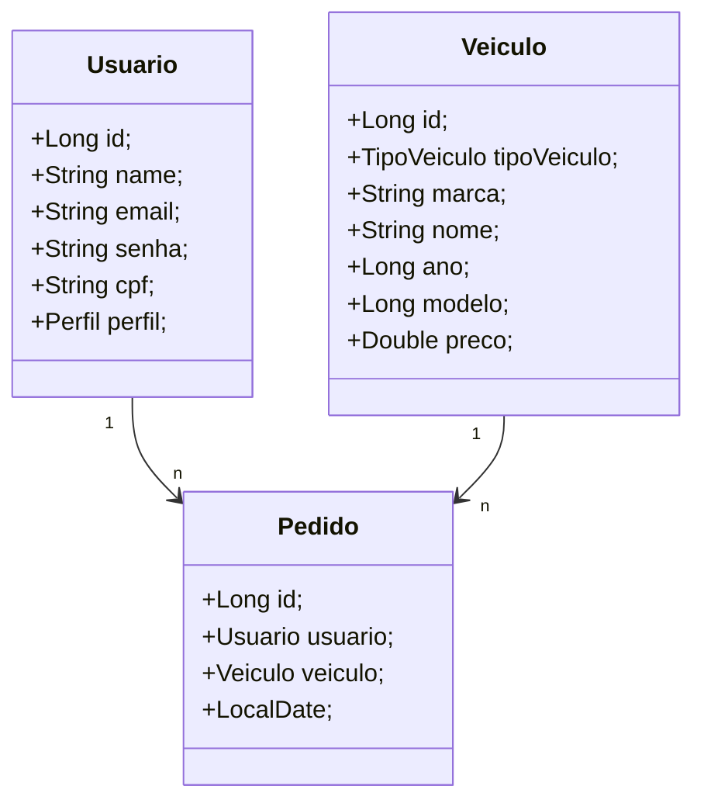

# Vendas

## Sobre o projeto

Microserviço que simula um app de Venda de Veículos

## Técnologias Usadas

- Spring JPA
- Spring Security
- Autenticação JWT
- H2 database

## Diagrama das Classes

```mermaid
classDiagram
    class Usuario{
        +Long id;
        +String name;
        +String email;
        +String senha;
        +String cpf;
        +Perfil perfil;
    }
    
    class Veiculo{
        +Long id;
        +TipoVeiculo tipoVeiculo;
        +String marca;
        +String nome;
        +Long ano;
        +Long modelo;
        +Double preco;
    }
    
    class Pedido{
        +Long id;
        +Usuario usuario;
        +Veiculo veiculo;
        +LocalDate;
    }
    
    Usuario "1" --> "n" Pedido
    Veiculo "1" --> "n" Pedido
```